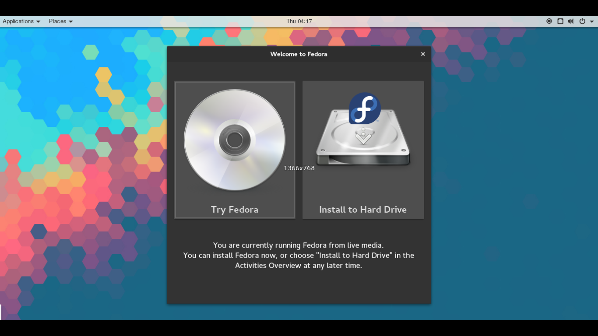

# fedora-uct-remix
Fedora Linux distribution remixed for UCT engineering students. 

It is a live image and must be written to a USB or CD/DVD using any of a number of available software options.

eg. http://www.linuxliveusb.com/ for Windows or https://fedorahosted.org/liveusb-creator/ for Linux.

The remix was created using the kickstart process, a good article explaing how to do this is here:

https://fedoraproject.org/wiki/How_to_create_and_use_a_Live_CD

I have included the torrent file (which may or may not work... or you can dowload the .ks file and create the ISO on a Fedora linux system). Some changes will need to be made to the .ks file, but the basics are there.

The default Fedora Workstation distribution can be downloaded from here: https://getfedora.org/

**Software**

Preinstalled: 

Packaged:
